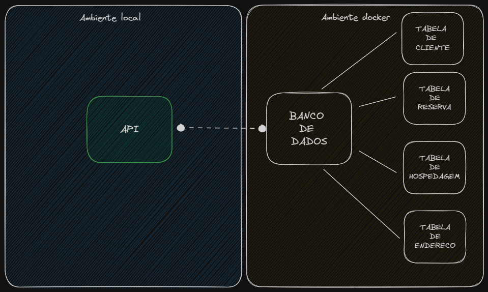

# dream_project 🚀

### Desenho da solução e suas integrações
- primeira fase:



## Tecnologias aplicadas

* kotlin 1.8.22 com java 17
* spring framework versão 3.x.x
    * starter web mvc
* JPA
  * Mysql
* Lombok
* spring-docker-compose
* ... mais coisas ( ao infinito e além ) 🚀

## Regra de negócio da api
...

## Como testar aplicação

### Endpoints
> certifique-se de antes de executar a aplicação estar com o ambiente docker em execução caso contrário nao irá persistir os dados
- /customer : rota comum
  - register[POST] : cria um usuário
```shell
curl --request POST \
  --url http://localhost:8080/customers/register \
  --header 'Content-Type: application/json' \
  --data '{
    "nome": "João",
		"sobrenome" : "fulano de tal",
    "email": "joao@example.com",
    "telefone": "1234567890",
    "dataNascimento": "1990-01-01",
    "cpf": "12345678901",
    "responsavel": false,
    "endereco": {
        "logradouro": "Rua A",
        "numero": "123",
        "complemento": null,
        "bairro": "Bairro A",
        "cidade": "Cidade A",
        "estado": "AA",
        "cep": "12345-678"
    }
}'
```
- /customer : rota comum
  - search[GET] : busca um cliente atraves do CPF
```shell
curl --request GET \
  --url http://localhost:8080/customers/search/666-666-666-66
```
> recupera cliente criado via SQL em ./init/01.sql

retorno:

```json
{
	"cpf": "666-666-666-66",
	"nome": "nome- teste",
	"sobrenome": "sobrenome- teste",
	"email": "teste@gmail.com",
	"telefone": "55-55555-5555",
	"dataNascimento": "10/08/1999",
	"responsavel": true,
	"endereco": {
		"id": 1,
		"logradouro": "logradouro",
		"numero": "300",
		"complemento": "esquina",
		"bairro": "bairro",
		"cidade": "SP",
		"estado": "SP",
		"cep": "3124124-22"
	}
}
```

- /bookings : rota comum
  - [GET] : busca todos as reservas cadastradas no banco de dados
```shell
curl --request GET \
  --url http://localhost:8080/bookings
```
- Exemplo de resposta
```json
[
	{
		"id": 1,
		"cliente": {
			"cpf": "666-666-666-66",
			"nome": "nome- teste",
			"sobrenome": "sobrenome- teste",
			"email": "teste@gmail.com",
			"telefone": "55-55555-5555",
			"dataNascimento": "10/08/1999",
			"responsavel": true,
			"endereco": {
				"id": 1,
				"logradouro": "logradouro",
				"numero": "300",
				"complemento": "esquina",
				"bairro": "bairro",
				"cidade": "SP",
				"estado": "SP",
				"cep": "3124124-22"
			}
		},
		"hospedagem": {
			"id": 1,
			"tipo": "Casa",
			"localizacao": "Perto da Praia",
			"capacidade": 6,
			"precoPorNoite": 250.0,
			"endereco": {
				"id": 1,
				"logradouro": "logradouro",
				"numero": "300",
				"complemento": "esquina",
				"bairro": "bairro",
				"cidade": "SP",
				"estado": "SP",
				"cep": "3124124-22"
			}
		},
		"dataInicio": "2023-05-10",
		"dataFim": "2023-05-17",
		"status": "CONCLUIDA"
	}
]
```

## DockerCommands

* docker-compose up = inicia o docker

Para acessar a base de dados dentro do container docker
```shell
mysql -u root -p 
```
Acesse a base criada via compose

```shell
use db;
```

### MySQLCommands - db

* showdatabases; = mostra as bases de dados que estão no mysql
* use db; = seleciona o banco de dados
* create table; = cria uma tabela / ex: create table clientes(id int primary key, nome varchar (255));
* show tables; = mostra as tabelas existentes
* describe tb_name; = descreve a tabela
* select * from tb_name; = mostra os dados que estão na tabela