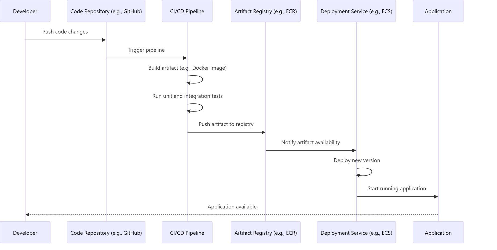
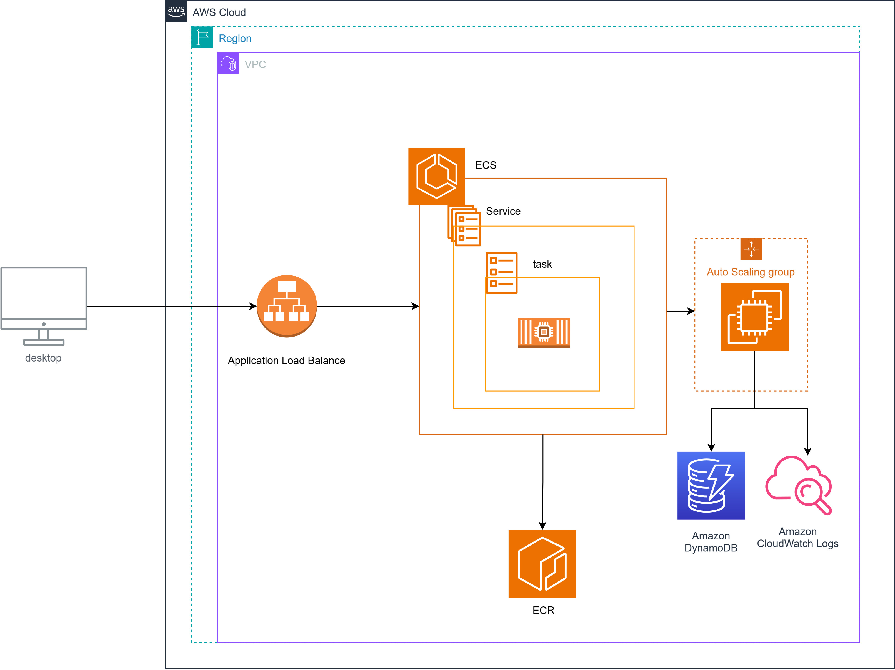

# Aluguel por Temporada: Desde a concepção a implantação

Neste documento, exploraremos como foi construído o provisionamento de recursos na nuvem para o projeto “Aluguel por Temporada”, bem como as configurações necessárias para a arquitetura escolhida. Da esteira do projeto à implantação na cloud, abordaremos vários conceitos, princípios e aplicações práticas.

## Construção Inicial do Projeto e Implantação na Nuvem

Este documento é uma introdução ao ciclo de vida completo do projeto, desde sua concepção local até a utilização de ferramentas modernas e automatizadas na nuvem, cobrindo:

1. **Configuração Inicial:** Ferramentas, dependências e estrutura do projeto.
2. **Pipeline de CI/CD:** Integração Contínua e Entrega Contínua configuradas.
3. **Provisionamento na Nuvem:** Implementação de serviços e recursos necessários na AWS.


## Configuração inicial:

Aqui vamos abordar os seguintes conceitos:

- Docker e containerização(existe essa palavra?) da aplicação.
- Entendimento da aplicação.
- Configuração do build da aplicação.
- Github actions: Criação de esteira automatizando a entrega para implantação
- AWS: Provisionamento de recursos e configurações.


### Containerizando a aplicação

Containerizar uma aplicação em uma imagem usando `Dockerfile` significa encapsular tudo o que sua aplicação precisa para ser executada, como o código, bibliotecas, dependências, configurações e ambiente de execução, em uma imagem Docker.

 Usamos o Dockerfile como um modelo(ou esqueleto/blueprint) que `contém o sistema operacional base`, o `ambiente necessário`, java por exemplo seguido dos comandos para no momento que montar a imagem realizar o script na execução, consequentemente executando a aplicação ao executar a imagem, criando meio que uma automatização do processo.

 Algumas vantagens:

- **Portabilidade**: Como a imagem contém todas as dependências da aplicação, ela pode ser executada em qualquer ambiente (Windows, macOS, Linux) que suporte Docker.

- **Isolamento**: Cada container opera de forma isolada, garantindo que configurações, bibliotecas ou atualizações não interferem em outras aplicações.

- **Consistência**: Garantia de que sua aplicação funcione de forma idêntica em desenvolvimento, teste e produção.

- **Eficiência**: Containers são mais leves e rápidos que máquinas virtuais.

### Como containerizar a aplicação

Com base na descrição em Containerização vamos aplicar agora esses conceitos em nosso projeto. Para isso observe o snippet abaixo:

```Dockerfile
# Build stage
FROM amazoncorretto:17 AS build
WORKDIR /app

# Instalar dependências
RUN yum install -y bash unzip dos2unix

# Copiar arquivos necessários do projeto
COPY ./gradlew ./gradlew
COPY ./gradle /app/gradle
COPY ./build.gradle.kts ./settings.gradle.kts /app/
COPY ./src /app/src

# Converter para formato UNIX e garantir permissões
RUN dos2unix gradlew && chmod +x gradlew

# Construir aplicação Kotlin com Spring Boot
RUN ./gradlew build -x test

# Package stage
FROM amazoncorretto:17
WORKDIR /app

# Definir variáveis de ambiente
ENV JAR_NAME=app.jar

# Copiar JAR gerado
COPY --from=build /app/build/libs/*.jar $JAR_NAME

# Expor a porta usada pela aplicação
EXPOSE 8080

# Comando de execução
ENTRYPOINT ["java", "-jar", "app.jar"]
```

Observe os conceitos de capturar os arquivos de uma instância local para repassar a imagem, para que seja possível, compilar o projeto e executar os comandos necessário para preparar o projeto para execução. Semelhante ao processo de execução local fora do docker, mas nesse caso, montamos nosso script para que ao executar a imagem seja feito todas essas tarefas.

Observe o conjunto utilizado, montamos a imagem usando outra imagem docker para permitir ter um sistema operacional, nesse caso usamos a amazoncorreto, uma distrubuição com o jdk instalado, que iremos usar após compilar com gradle fazer a execução do nosso arquivo jar. Como nossa aplicação também executa na porta 8080 precisamos expor a rota 8080 na imagem docker,caso contrário não será permitido chegar até a aplicação as requisições http.

## Pipeline de CI/CD:

Uma pipeline CI/CD (Continuous Integration and Continuous Deployment/Delivery) é uma série de etapas automatizadas que ajudam a integrar código, testar, construir e implantar software

- **CI (Continuous Integration)**: Integração contínua é o processo de mesclar regularmente o código de todos os desenvolvedores em um repositório compartilhado e, em seguida, executar verificações automatizadas, como:

    - Testes unitários.
    - Análises de qualidade de código.
    - Builds automáticos. Objetivo: Garantir que o código enviado funcione em conjunto com outras partes do sistema.

- **CD (Continuous Deployment/Delivery)**: É dividido em:

    - **Continuous Delivery**: Após o build e testes automatizados, o código está pronto para ser implantado (deployment), mas requer aprovação manual.
    - **Continuous Deployment**: Todo o pipeline é completamente automatizado, e qualquer alteração aprovada é automaticamente enviada para o ambiente de produção. Objetivo: Garantir que o software seja facilmente implantado em produção com pouca intervenção manual.

### Componentes da pipeline

- Código: 
    - Alterações no código são enviadas para o repositório (ex.: GitHub).

- Build
    - O código é convertido em um executável ou artefato, como uma imagem Docker.
- Testes
    - Testes automatizados verificam a funcionalidade do código.
        - Testes unitários ou integração.
- Liberação
    - O artefato é enviado para um registro (ex.: Amazon ECR).

- Implantação
    - O sistema é implantado automaticamente em um ambiente (ex.: Implantando em um serviço ECS).

### Benefícios de uma Pipeline CI/CD
- Rapidez: Integração e implantação mais rápidas.
- Confiabilidade: Reduz erros manuais por meio da automação.
- Qualidade: Identifica problemas cedo (no estágio de integração ou teste).
- Consistência: Aplicações sempre rodarão em ambientes consistentes.

### Diagrama do fluxo para implantação



### Usando Github Actions para automatização da pipeline

GitHub Actions é uma plataforma de integração contínua (CI) e entrega contínua (CD) que oferece automação nativa integrada ao GitHub. Nela vamos configurar nossa pipeline do projeto para que possamos realizar a nossa implantação

Com arquivos YAML no repositório (armazenados em `.github/workflows`), é possível configurar pipelines detalhadamente, por exemplo: etapas de build, test e deploy.

As actions do Github permite que a gente execute tarefas de maneiras automatizada em ambiente linux, e containers docker ! além de permitir controle por branch para acionar um workflow, um workflow nada mais que um arquivo de configuração com um script que deve ser executado ao cair na condição esperada, por exemplo, em um pull request acionar o build, test e analise de código mas não realizar a implantação por exemplo, pois está em draft :D !

Nas actions a gente tem também output com logs e alertas de execução, caso falhe a etapa de build, o workflow é interrompido até o ajuste, garantindo a confiabilidade em uma implantação sem necessáriamente subir com um erro que não permita compilar ou em testes falhando.

Com actions a gente pode integrar com workflow externos, é possível encontrar esses workflows como se fosse uma playstore do github, nele no nosso projeto usamos os seguintes workflows:

- **gradle/gradle-build-action:** Permite que a gente execute o build ou test, com uma imagem que a gente possa executar tarefas do gradle :D
- **aws-actions/configure-aws-credentials**: Permite que a gente possa configurar nossa conta e realizar operações no AWS em nossa conta, permitindo o envio do nosso serviço aos recursos provisionados previamente.
- **aws-actions/amazon-ecs-render-task-definition**: Para que a gente possa associar nossa definição de tarefas a um serviço que será implantando no AWS.
- **aws-actions/amazon-ecs-deploy-task-definition**: Momento que em será realizado o deploy do serviço ao recurso do ECS

### Exemplos práticos

Agora com toda a base de conhecimento repassada, vamos olhar na prática como é feito tudo isso no github :D

#### Pipeline de pull requests

Precisamos garantir que todo codigo desenvolvido passe pelas etapas de verificação antes de iniciar uma implantação, com base nisso podemos assumir que iremos usar o seguinte `Gitflow`
- Toda atualização ou ajuste deve ser uma branch criada a partir da mão, e para deixar no estágio pronto para merge, deve ser criado um pull request para  main[executa workflow de deploy]

Com isso iremos garantir que o código que for mergeado para main terá o minímo testado, será compilável e os testes não irão falhar. Se todo o workflow foi executado e foi passado com sucesso, é um código confiavel e pode ser mergeado para a main :) !

#### Workflow para pull requests[**Validação**]:

```yml
# Nome do workflow exibido na interface do GitHub Actions
name: Continuous Integration with Gradle

# Define os eventos que acionam o workflow
on:
  pull_request: # O workflow é executado quando há um Pull Request
    branches: [ "*" ] # Acionado para todas as branches (wildcard "*")

# Define as permissões para o workflow
permissions:
  contents: read # Permite apenas leitura do conteúdo do repositório

# Definição dos jobs
jobs:
  # Job chamado 'build'
  build:
    runs-on: ubuntu-latest # O job será executado em uma máquina com o Ubuntu mais recente

    steps: # Passos que o job vai executar
    - uses: actions/checkout@v3 # Faz o clone do repositório na máquina de execução
    - name: Set up JDK 17 # Nome amigável para a etapa
      uses: actions/setup-java@v3 # Ação que configura o ambiente Java
      with:
        java-version: '17' # Define a versão do Java como 17
        distribution: 'temurin' # Usa a distribuição 'temurin' do Adoptium
    - name: Make gradlew executable # Torna o script 'gradlew' executável
      run: chmod +x gradlew # Comando shell para adicionar permissão de execução ao arquivo
    - name: Build with Gradle # Nome da etapa de build
      uses: gradle/gradle-build-action@bd5760595778326ba7f1441bcf7e88b49de61a25 # Ação para executar o Gradle
      with:
        arguments: build -x test # Roda a task 'build' e exclui os testes (-x test)

  # Job chamado 'test'
  test:
    runs-on: ubuntu-latest # O job será executado em uma máquina com o Ubuntu mais recente

    steps: # Passos que o job vai executar
    - uses: actions/checkout@v3 # Faz o clone do repositório na máquina de execução
    - name: Set up JDK 17 # Nome amigável para a etapa
      uses: actions/setup-java@v3 # Ação que configura o ambiente Java
      with:
        java-version: '17' # Define a versão do Java como 17
        distribution: 'temurin' # Usa a distribuição 'temurin' do Adoptium
    - name: Make gradlew executable # Torna o script 'gradlew' executável
      run: chmod +x gradlew # Comando shell para adicionar permissão de execução ao arquivo
    - name: Test with Gradle # Nome da etapa de testes
      uses: gradle/gradle-build-action@bd5760595778326ba7f1441bcf7e88b49de61a25 # Ação para executar o Gradle
      with:
        arguments: test # Executa apenas a task 'test' para rodar os testes automatizados

```

#### Workflow da branch Main[**Deploy**]

Conforme a etapa anterior, em um cenário de sucesso podemos garantir que o código pode ser implantado em produção, para que clientes que usem nosso serviço tenham a garantia que o serviço não será interrompido durante demanda. Quando levado as atualizações para a branch main será executado o workflow de implantação, onde é feito um novo build e test e por fim o deploy(Isso pode ser melhorado, podemos deixar a branch main com regra de rejeitas push direto e ai eliminar as etapas de build e test posteriormente). Isso irá acionar os scrips que é usados no workflow em nossa pipeline no github actions

#### Workflow de deploy 

```yml
# Nome do workflow exibido na interface do GitHub Actions
name: Build, Test and Deploy to AWS

# Define os eventos que acionam o workflow
on:
  push: # O workflow será executado quando houver um push
    branches:
      - main # Especificamente na branch 'main'

# Define as permissões necessárias para o workflow
permissions:
  id-token: write # Necessário para autenticação com AWS (usando OIDC)
  contents: read # Permissão para ler o conteúdo do repositório

# Variáveis de ambiente acessíveis globalmente dentro do workflow
env:
  AWS_REGION: sa-east-1 # Região da AWS para operações (Brasil - São Paulo)
  ECR_REPOSITORY: aluguel-por-temporada # Nome do repositório no Amazon ECR
  ECS_SERVICE: service-aluguel-por-temporada-app # Nome do serviço ECS
  ECS_CLUSTER: cluster-aluguel-por-temporada-projeto # Nome do cluster ECS
  CONTAINER_NAME: container-aluguel-temporada-ecs # Nome do contêiner no ECS
  ROLE: arn:aws:iam::257394470489:role/role-ecs-github-access # ARN da role usada para assumir permissões na AWS

# Definição dos jobs
jobs:
  build: # Job para construção do projeto
    name: Build Project # Nome amigável do job
    runs-on: ubuntu-latest # Executado em uma máquina com Ubuntu

    steps: # Etapas executadas pelo job
      - name: Checkout repository # Etapa para clonar o repositório
        uses: actions/checkout@v3

      - name: Set up JDK 17 # Configurar a versão do Java
        uses: actions/setup-java@v3
        with:
          java-version: '17' # Usar a versão 17 do Java
          distribution: 'temurin' # Usar a distribuição Temurin

      - name: Make gradlew executable # Torna 'gradlew' executável
        run: chmod +x gradlew # Comando shell para adicionar permissão de execução

      - name: Build with Gradle # Etapa de build do projeto
        uses: gradle/gradle-build-action@bd5760595778326ba7f1441bcf7e88b49de61a25 # Especificação da ação de build Gradle
        with:
          arguments: build -x test # Executa o build e exclui os testes

  test: # Job para execução dos testes
    name: Run Tests # Nome amigável do job
    runs-on: ubuntu-latest
    needs: build # Este job depende do 'build' para começar
    steps:
      - name: Checkout repository # Etapa para clonar o repositório
        uses: actions/checkout@v3

      - name: Set up JDK 17 # Configura a versão do Java
        uses: actions/setup-java@v3
        with:
          java-version: '17'
          distribution: 'temurin'

      - name: Make gradlew executable # Torna 'gradlew' executável
        run: chmod +x gradlew

      - name: Test with Gradle # Etapa para rodar testes com Gradle
        uses: gradle/gradle-build-action@bd5760595778326ba7f1441bcf7e88b49de61a25
        with:
          arguments: test # Executa somente os testes

  deploy: # Job para implantação no AWS ECS
    name: Deploy to AWS ECS # Nome amigável do job
    runs-on: ubuntu-latest
    needs: test # Este job depende do 'test' para começar
    steps:
      - name: Checkout repository # Etapa para clonar o repositório
        uses: actions/checkout@v3

      - name: Configure AWS credentials # Configura credenciais para acessar AWS
        uses: aws-actions/configure-aws-credentials@v4
        with:
          audience: sts.amazonaws.com # Serviço de autenticação (STS)
          role-to-assume: ${{ env.ROLE }} # Role para assumir permissões na AWS
          aws-region: ${{ env.AWS_REGION }} # Região AWS configurada

      - name: Login to Amazon ECR # Login no repositório Amazon ECR
        id: login-ecr # Define um identificador para este passo
        uses: aws-actions/amazon-ecr-login@v1

      - name: Build, tag, and push image to Amazon ECR # Construção e envio de imagem Docker para ECR
        id: build-image # Define um identificador para este passo
        env:
          ECR_REGISTRY: ${{ steps.login-ecr.outputs.registry }} # Registro do ECR obtido no login
          ECR_REPOSITORY: ${{ env.ECR_REPOSITORY }} # Nome do repositório no ECR
          IMAGE_TAG: ${{ github.sha }} # Tag da imagem baseada no SHA do commit
        run: |
          docker build -t $ECR_REGISTRY/$ECR_REPOSITORY:$IMAGE_TAG . # Construção da imagem Docker
          docker push $ECR_REGISTRY/$ECR_REPOSITORY:$IMAGE_TAG # Envia a imagem para o ECR
          echo "image=$ECR_REGISTRY/$ECR_REPOSITORY:$IMAGE_TAG" >> $GITHUB_OUTPUT # Salva o nome da imagem

      - name: Download task definition # Baixa a definição da tarefa ECS
        run: |
          aws ecs describe-task-definition --task-definition task-definition-family-aluguel-por-temporada-2 --query taskDefinition > task-definition.json

      - name: Fill in the new image ID in the Amazon ECS task definition # Atualiza a definição de tarefa com a nova imagem
        id: task-def
        uses: aws-actions/amazon-ecs-render-task-definition@v1
        with:
          task-definition: task-definition.json
          container-name: ${{ env.CONTAINER_NAME }} # Nome do container no ECS
          image: ${{ steps.build-image.outputs.image }} # Nova imagem gerada

      - name: Amazon ECS Deploy # Implanta o serviço ECS
        uses: aws-actions/amazon-ecs-deploy-task-definition@v2
        with:
          task-definition: ${{ steps.task-def.outputs.task-definition }} # Define a tarefa ECS
          service: ${{ env.ECS_SERVICE }} # Serviço ECS onde a tarefa será implantada
          cluster: ${{ env.ECS_CLUSTER }} # Cluster ECS utilizado
          wait-for-service-stability: true # Aguarda até que o serviço esteja estável
```

Com isso finalizamos a construção da nossa pipeline que automatiza o processo de entrega do nosso serviço no github ! 

## Provisionamento na Nuvem

É utilizado no serviço os serviços da AWS, permite que a gente consiga centralizar nossas implantações do serviço usando os serviços de nuvem Amazon Web Service. Com o AWS 

Beneficios de usar um provedor de nuvem(AWS):

1. **Escalabilidade Sob Demanda**
    - Crescimento Dinâmico: A AWS permite aumentar ou reduzir a capacidade de recursos com facilidade, acompanhando suas necessidades em tempo real.
    - Auto Scaling: Ferramentas integradas ajudam a ajustar automaticamente os recursos, garantindo eficiência sem intervenção manual.

2. Confiabilidade
    - Infraestrutura Global: Com data centers distribuídos globalmente, a AWS oferece alta disponibilidade, com redundância geográfica e tolerância a falhas.
    - SLA Garantido: O SLA de uptime para muitos serviços é de 99,99% ou superior, garantindo operação contínua.

3. Custo-Efetividade
    - Modelo Pay-as-You-Go: Você só paga pelos recursos que realmente usa, sem custos iniciais pesados.
    - Preço Competitivo: A AWS ajusta frequentemente seus preços para competir com outros provedores de nuvem, tornando-a uma das opções mais acessíveis.
    - Savings Plans e Instâncias Reservadas: Descontos adicionais para uso contínuo ou compromissos de longo prazo.

4. Variedade de Serviços
    - Mais de 200 Serviços: A AWS oferece ferramentas para computação (EC2, Lambda), armazenamento (S3, EBS), banco de dados (RDS, DynamoDB), inteligência artificial (SageMaker), IoT, DevOps e muito mais.
    - Integração entre Serviços: A maioria dos serviços é projetada para trabalhar em conjunto, proporcionando soluções completas.

5. Segurança e Conformidade
    - Altos Padrões de Segurança: Criptografia ponta a ponta, gerenciamento de identidades (IAM) e ferramentas de monitoramento são padrão na AWS.
    - Conformidade: Certificações e regulamentos como ISO 27001, GDPR, HIPAA e PCI DSS tornam a AWS confiável para negócios regulamentados.

6. Inovação Constante
    - Recursos Pioneiros: AWS é líder de mercado e frequentemente lança novos serviços antes da concorrência, com tecnologias como machine learning, serverless e containers.
    - Personalização: A variedade de ferramentas permite customizar soluções específicas para sua necessidade.

7. Ecosistema Global e Suporte
    - Rede de Parceiros: Parcerias com milhares de empresas, desenvolvedores e provedores de software para integrações mais fáceis.
    - Treinamento e Certificação: A AWS oferece programas para aprender e se especializar em suas ferramentas, incluindo certificações amplamente reconhecidas.

8. Suporte Multiplataforma
    - APIs e SDKs: Compatível com múltiplas linguagens e plataformas, incluindo Java, Python, Node.js, etc.
    - Compatibilidade com Frameworks: Suporta integrações com tecnologias como Docker, Kubernetes, Terraform, e muito mais.

9. Redução do Tempo de Implementação
    - Deploy Rápido: Configure uma aplicação global em minutos.
    - Ferramentas para DevOps: Recursos como AWS CodePipeline, CodeBuild e CodeDeploy aceleram o ciclo de desenvolvimento.

10. Sustentabilidade
    - Infraestrutura Verde: A AWS está comprometida com operações energéticas eficientes, usando fontes renováveis e tecnologias inovadoras.

Depois da gente citar alguns beneficios do aws, precisamos também falar dos pilares do Well-Architected Framework, é um conjunto de pilares que auxilia o desenvolvedor a seguir boas práticas para os serviços usando os serviços do AWS.


1. Excelência Operacional (Operational Excellence)
Objetivo:
Gerenciar e monitorar sistemas para fornecer resultados de negócios e melhorar continuamente processos e procedimentos.

Principais Práticas:
Implementar monitoramento automatizado para prever e resolver problemas rapidamente.
Utilizar Infraestrutura como Código (IaC) para automação e padronização.
Documentar processos e usar runbooks e playbooks para resposta a incidentes.
Realizar testes e revisões regulares.
Benefícios:
Melhoria contínua, com operações que suportam mudanças rápidas e processos eficazes.

2. Segurança (Security)
Objetivo:
Proteger dados, sistemas e ativos para melhorar a postura de segurança na nuvem.

Principais Práticas:
Implementar princípio de privilégio mínimo com o gerenciamento de identidades (IAM).
Usar criptografia em trânsito e em repouso para proteger dados.
Configurar monitoramento ativo e alertas para detecção de ameaças.
Gerenciar vulnerabilidades por meio de atualizações regulares.
Benefícios:
Minimiza os riscos de violações e protege informações sensíveis.

3. Confiabilidade (Reliability)
Objetivo:
Garantir que a carga de trabalho possa se recuperar de falhas, atender a requisitos de disponibilidade e dimensionar conforme necessário.

Principais Práticas:
Projetar para recuperação automática e tolerância a falhas.
Configurar replicação de dados e backups regulares.
Testar continuamente os processos de recuperação de desastres.
Usar ferramentas como Amazon Route 53 e ELB para disponibilidade global.
Benefícios:
Resiliência contra interrupções planejadas e não planejadas.

4. Eficiência de Desempenho (Performance Efficiency)
Objetivo:
Usar os recursos de computação de forma eficiente e manter a capacidade de atender a requisitos em evolução.

Principais Práticas:
Escolher tipos de instâncias adequados para o workload.
Utilizar serviços elásticos, como AWS Lambda, para ajustar-se a picos de demanda.
Testar com diferentes configurações usando ferramentas como AWS Compute Optimizer.
Monitorar métricas e ajustar continuamente.
Benefícios:
Garante que você esteja entregando desempenho ideal, mesmo com mudanças na carga de trabalho.

5. Otimização de Custos (Cost Optimization)
Objetivo:
Minimizar os custos e obter o máximo de valor da infraestrutura.

Principais Práticas:
Usar instâncias reservadas ou spot para cargas de trabalho de longo prazo ou flexíveis.
Automatizar o desligamento de recursos ociosos.
Monitorar custos com AWS Cost Explorer e AWS Budgets.
Usar serviços gerenciados, como AWS Fargate, quando apropriado.
Benefícios:
Evita desperdícios e permite reinvestimento em inovações.

6. Sustentabilidade (Sustainability)
Objetivo:
Minimizar o impacto ambiental de cargas de trabalho executadas na nuvem.

Principais Práticas:
Escolher serviços e recursos energeticamente eficientes.
Arquitetar cargas de trabalho para reduzir a necessidade de processamento e armazenamento desnecessários.
Monitorar e relatar métricas ambientais.
Adotar abordagens de código limpo e design eficiente.
Benefícios:
Ajuda a cumprir metas ambientais e a operar de maneira ecologicamente responsável.

### Arquitetura do projeto

> Descrição:
Dentro da TASK é o container.
O componente que se comunica com DynamoDb e CloudWatch é o EC2


### Provisionando recursos e entendendo conceitos.

Agora vamos abordar conceitos de :

- Roles: Role é uma entidade que a gente configura, essa Role é responsável por garantir acesso a um usuário ou serviço do aws. Por exemplo a gente criou uma role para garantir que a nossa pipeline do repositório possa acessar nossos recursos do aws e fazer implantação no serviço do ecs. Com isso a gente configura quais ações ele pode fazer em um recurso ou na conta, inclusive algumas operações da API, como listar items de um banco de dados ou excluir por exemplo, garantindo limitações a um recurso ou serviço do aws.
Por exemplo: [IMAGEM]

- Policy: É um documento JSON que define permissões para acessar recursos do AWS. Ela especifica as ações permitidas ou negadas em relação a serviços e recursos específicos. Por exemplo: [IMAGEM]

- Security Group: Com ele você pode controlar quem pode entrar(requests) e quais podem sair (response), então por exemplo se você tem uma instância ec2 com uma aplicação implantada em uma porta exposta 8080 no servidor, é necessário ir nas configurações de security group associado ao recurso e liberar a porta 8080 para um ip(seu por exemplo) ou para a internet para que qualquer possa fora da sua rede possa ter acesso e solicitar uma requisição a uma apliação no AWS EC2 com o security group permitindo a porta 8080 à internet.

- Elastic Container Registry(ECR): É onde hospedamos as imagens da aplicação, quando rodamos o comando na esteira de docker build é criado a imagem docker para ficar a disposição no serviço da AWS para que seja executado a imagem e seja criado um container da nossa aplicação. Se você reparou ele é similar ao Docker hub, ou se quiser algo mais simples um banco de dados mas para imagens Docker.
- 
- Elastic Compute Cloud (EC2): Nada mais nada menos que uma aplicação na nuvem, como se fosse seu próprio computador executando uma aplicação ou algum script por exemplo, a vantagem aqui é a computação sob demanda fazendo escalamento VERTICAL(UPGRADE DE MÁQUINA) e também permitindo ser escalável HORIZONTAL(clones de instâncias) tudo sob demanda. Fora todos os recursos que complementa o EC2, controle com security groups, customizações e etc..

- Elastic container Service(ECS): Como o próprio nome sugere, é um serviço que orquestra containers DOCKER, palavrinha chave, usamos esse serviço quando estamos dockerizando nossa aplicação em containers docker, como é nosso caso aqui. Então utilizamos esse recurso ECS para que possamos usar as definições e abstrações para implantação de containers em INSTANCIAS EC2. Isso vai garantir escalabilidade para containers obviamente, podemos configurar balanceadores para manter alta disponíbilidade dos serviços. Porém ECS compoem uma série de componentes, sendo eles: 
    - Task definitions, para definir as configurações do containers, uma espécie de contrato com o container da aplicação para expor ao ECS essas informações, por exemplo, a porta da aplicação e a quantidade de recursos que serão alocados para o serviço que estará orquestrando nosso container.
    - Cluster, como o nome sugere, é um grupo de recursos, onde os containers estão em execução(ou falhando haha) pense no cluster como um grupo de containers, compartilhando inclusive o mesmo servidor(em FARGATE[SERVERLESS]).
    - Serviços, onde configuramos um limite de tarefas a serem executadas, tarefas nada mais são que os containers em execução, então para cada serviço pense que é o containers da sua aplicação(Veja sobre isso na seção DockerFile rsrs) e aqui nossos serviços são instâncias do tipo EC2, usando referência da nossa máquina EC2.

- Application Load balancer: Como o nome sugere, é o nosso garçom aqui. Melhor amigo do dev, seu objetivo e pegar toda a carga de requisição que está chegando nessa interface e distribuir entre os containers do ECS. Quando a gente tem um cenário de alta carga um quinto dia útil por exemplo haha esse cara será o protagonista, distribuido a série de requisições entre instâncias, garatindo escalabilidade e alta disponibilidade, imagine toda a carta sendo passa para somente uma instância, pode ocorrer interrupções no nosso sistema. O ALB tem os seguintes componentes: 
    - Listeners: é o componente responsável por mapear a porta especifica e jogar para o destino nosso serviço do ECS por exemplo.
    - Rules: Aqui a gente pode brincar, mas basicamente é onde configuramos hosts, URLs ou condições de header que nosso ALB irá exigir para permitir a conexão.
    - Target Groups, Similar ao Security Groups aqui a gente irá configurar para onde o trafégo recebido no ALB terá como destino, no nosso caso o serviço ECS.

 